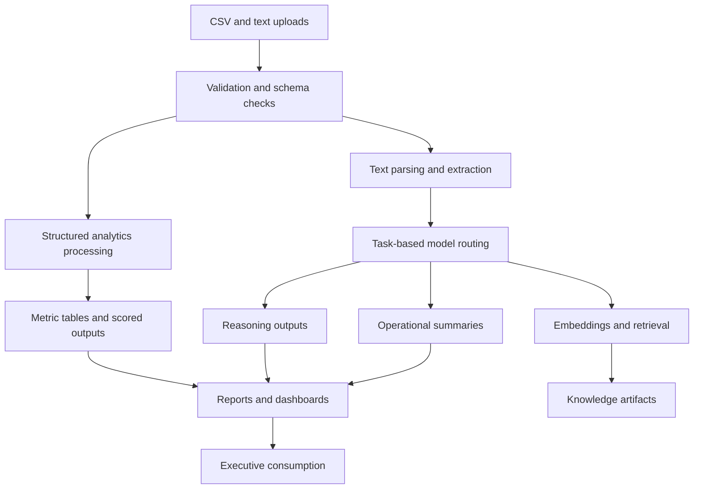

# Data Flow Architecture

## Purpose

Show the common path from uploads through validation, analytics, AI processing, and executive outputs.

## Intended Audience

Data leaders, AI architects, and technically minded executives.

## Why It Matters

This diagram explains how practical business data becomes decision-ready outputs across the suite.

## Mermaid Diagram

## Interpretation Notes

- The data path supports both quantitative and text-heavy use cases.
- Validation and analytics stay visible rather than disappearing behind an AI black box.
- Strong diagram for Director of Data and AI roles.

@BryteSikaStrategyAI
