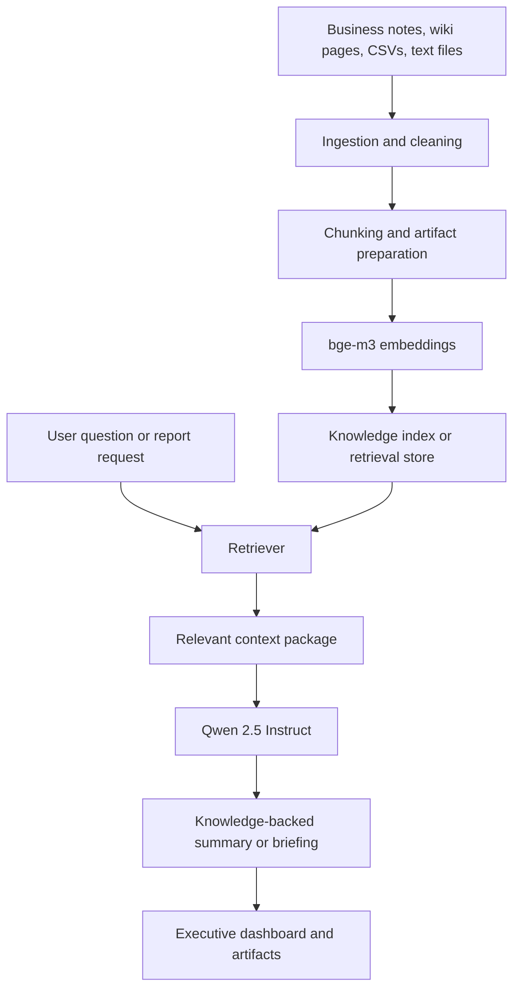

# Knowledge Brain and Retrieval Architecture

## Purpose

Show how Hustle Workforce can turn uploaded business context into retrieval-backed summaries and decision support.

## Intended Audience

AI product leaders, architects, and executive reviewers focused on knowledge workflows.

## Why It Matters

The Knowledge Brain pattern is one of the most portfolio-distinctive features because it ties institutional memory to executive output.

## Mermaid Diagram

## Interpretation Notes

- Retrieval is treated as a business-memory system, not just a generic search feature.
- The combination of embeddings and reasoning supports credible briefing generation.
- This is one of the strongest diagrams for portfolio differentiation.

@BryteSikaStrategyAI
