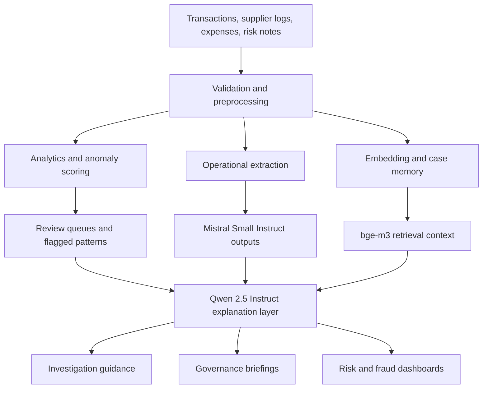

# Fraud and Risk Investigation Data Flow

## Purpose

Show how sensitive control-oriented data flows from ingestion to anomaly review, explanation, and governance output.

## Intended Audience

Risk, fraud, audit, and governance stakeholders.

## Why It Matters

This diagram makes the high-stakes side of the portfolio legible and commercially credible.

## Mermaid Diagram

## Interpretation Notes

- The flow separates scoring, extraction, retrieval, and explanation to support auditability.
- It is useful for interviews because it shows controlled AI use in sensitive workflows.
- The diagram supports both risk and fraud product narratives.

@BryteSikaStrategyAI
