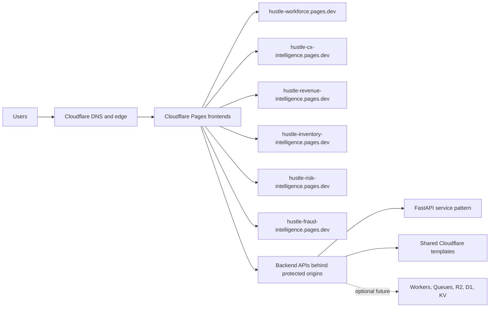

# Cloudflare-first Deployment Architecture

## Purpose

Show how the product suite is delivered through Cloudflare Pages, protected backend origins, and shared deployment patterns.

## Intended Audience

Platform architects, cloud reviewers, and hiring managers assessing deployment judgment.

## Why It Matters

The diagram demonstrates practical cloud positioning without pretending the stack is more complex than it needs to be.

## Mermaid Diagram

## Interpretation Notes

- Cloudflare Pages anchors the frontend delivery model.
- Shared deployment templates keep products aligned without forcing them into one monolith.
- This is ideal for cloud architecture conversations where clarity matters more than hype.

@BryteSikaStrategyAI
