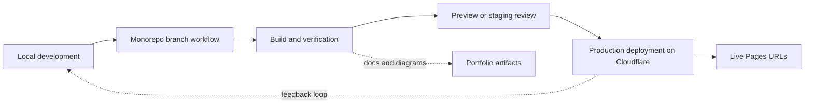

# Environment and Promotion Flow Diagram

## Purpose

Show how the repo can be explained across local development, test promotion, and production deployment.

## Intended Audience

Engineering managers, DevOps reviewers, and architecture interview panels.

## Why It Matters

A simple promotion view signals engineering maturity, release discipline, and portfolio stewardship.

## Mermaid Diagram

## Interpretation Notes

- The diagram intentionally stays simple and believable.
- It is enough to show controlled promotion without inventing an elaborate CI estate.
- Good for explaining how multiple products can still move through a consistent operating rhythm.

@BryteSikaStrategyAI
