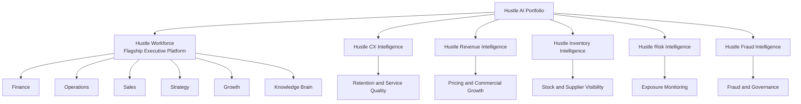

# Hustle AI Portfolio Map

## Purpose

Show the full Hustle AI product family under one executive umbrella, with Hustle Workforce positioned as the flagship platform.

## Intended Audience

Recruiters, hiring managers, executive stakeholders, and portfolio reviewers.

## Why It Matters

This diagram makes the suite feel like a coherent product strategy rather than a collection of disconnected apps.

## Mermaid Diagram

## Interpretation Notes

- Hustle Workforce acts as the broad executive operating layer.
- The other products deepen specialist visibility across customer, commercial, inventory, risk, and fraud domains.
- The map is useful for showing product breadth without overselling implementation detail.

@BryteSikaStrategyAI
