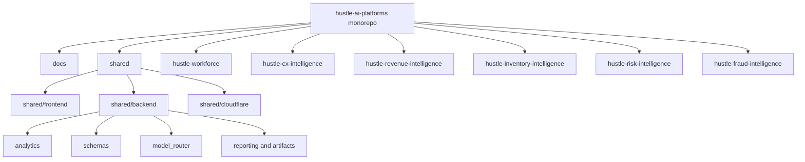

# Monorepo Platform Architecture

## Purpose

Show how the monorepo is structured to support multiple products through shared platform modules.

## Intended Audience

Engineering leaders, platform architects, and technical interview panels.

## Why It Matters

This diagram demonstrates reusable systems thinking, platform discipline, and product suite scalability.

## Mermaid Diagram

## Interpretation Notes

- The repo is organized around a platform core plus product-specific implementations.
- Shared modules reduce duplication while allowing each product to remain independently legible.
- The structure signals maturity in codebase ownership and portfolio management.

@BryteSikaStrategyAI
