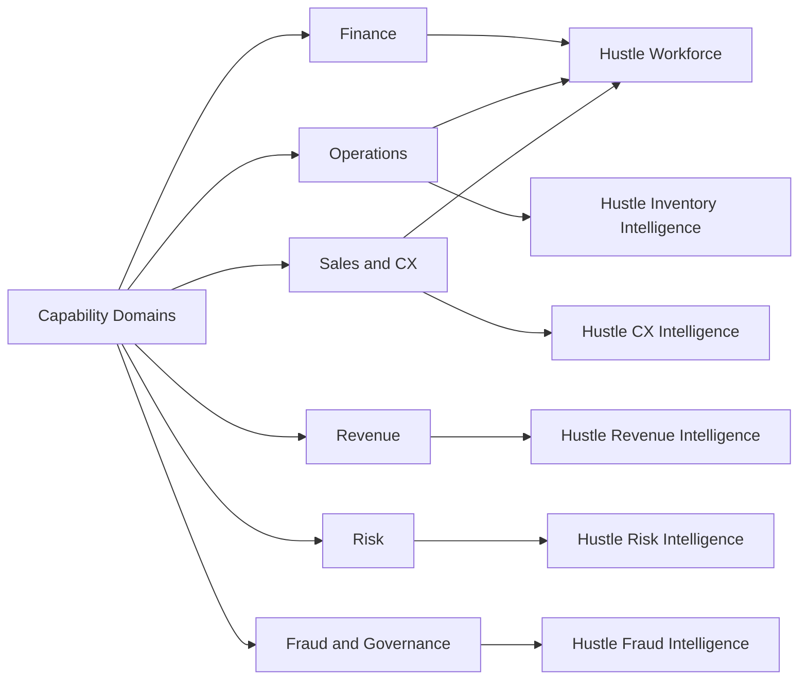

# Product Capability Matrix Diagram

## Purpose

Visualize how the six products cover the major operating domains of an SME-focused AI portfolio.

## Intended Audience

Executives, solution architects, and hiring managers.

## Why It Matters

This helps non-technical audiences quickly understand coverage across growth, operations, customer, risk, and governance needs.

## Mermaid Diagram

## Interpretation Notes

- Hustle Workforce spans multiple executive operating domains.
- Specialist products strengthen the suite in high-value decision areas.
- The matrix is especially useful in interviews where portfolio scope needs to be explained fast.

@BryteSikaStrategyAI
