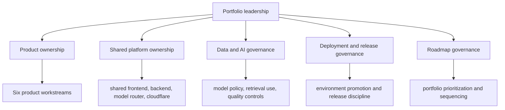

# Platform Governance and Operating Model

## Purpose

Show how ownership can be understood across products, shared platform modules, AI governance, and deployment standards.

## Intended Audience

CTO, Head of Engineering, Director, and enterprise operating-model discussions.

## Why It Matters

Leadership credibility depends on how clearly product ownership, platform stewardship, and governance responsibilities are framed.

## Mermaid Diagram

## Interpretation Notes

- The operating model is shown as a governance system, not just a coding structure.
- This is a particularly strong diagram for senior interview conversations.
- It helps position the repo as leadership-caliber work even before code walkthroughs begin.

@BryteSikaStrategyAI
