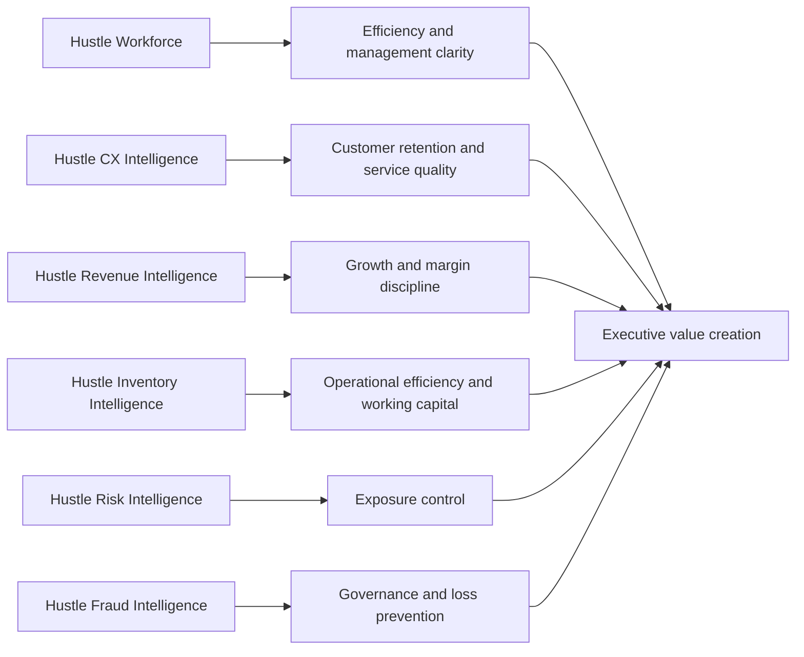

# Executive Value Chain Diagram

## Purpose

Show how the six products contribute to business value across growth, retention, efficiency, risk control, and governance.

## Intended Audience

Business executives, recruiters, and LinkedIn viewers.

## Why It Matters

This diagram connects architecture and product thinking back to commercial outcomes.

## Mermaid Diagram

## Interpretation Notes

- The suite is framed as a business value chain, not just a technical stack.
- This is one of the best diagrams to share publicly because it is easy to read and commercially legible.
- It is ideal for LinkedIn, recruiter screens, and portfolio intros.

@BryteSikaStrategyAI
