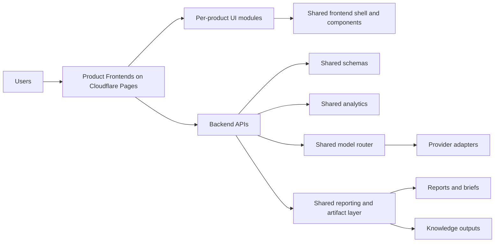

# Shared Frontend-Backend Architecture

## Purpose

Show how shared frontend, backend, analytics, and Cloudflare deployment layers support multiple product applications.

## Intended Audience

Platform engineers, architects, and CTO-level reviewers.

## Why It Matters

It presents the monorepo as a reusable platform system, not a set of isolated dashboards.

## Mermaid Diagram

## Interpretation Notes

- Shared layers sit behind branded product surfaces.
- Frontend reuse, backend discipline, and reporting consistency are all visible in one view.
- This is a strong architecture interview diagram because it connects product delivery to platform reuse.

@BryteSikaStrategyAI
