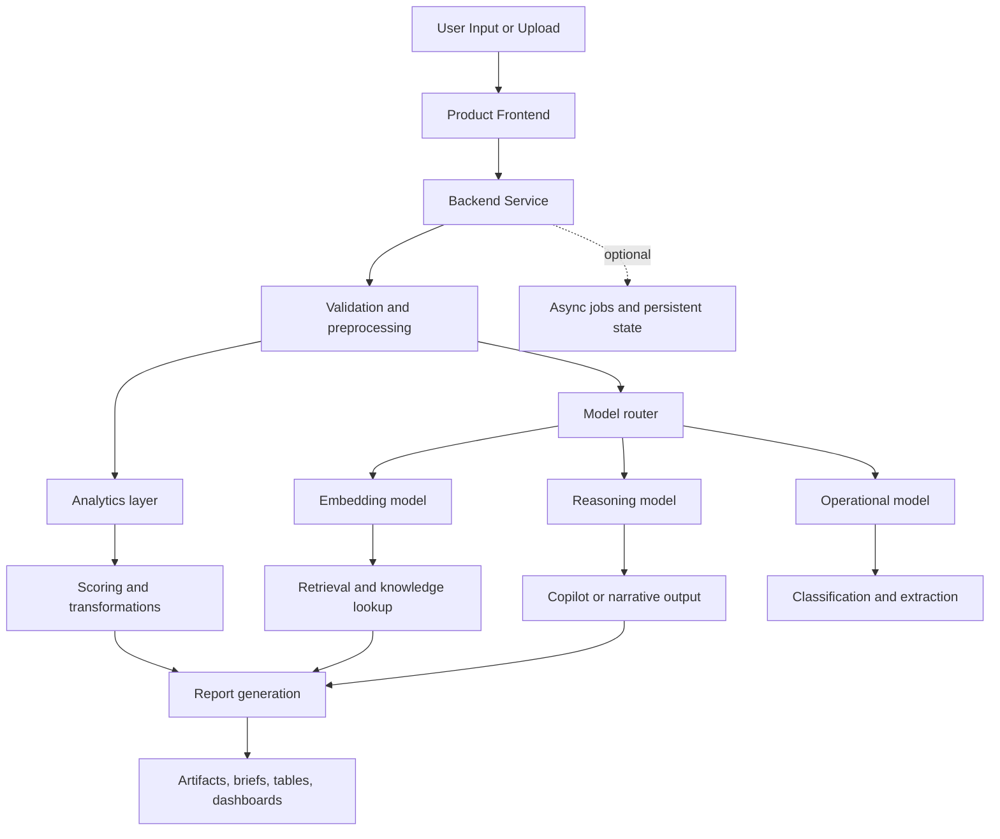

# Agent Platform Reference Architecture

## Purpose

Describe the reusable agent-ready flow from user action to analysis, routing, artifacts, and reports.

## Intended Audience

Engineering leadership panels, AI architects, and enterprise architecture reviewers.

## Why It Matters

It shows that the suite can be discussed as a structured AI operating platform rather than a thin UI over LLM calls.

## Mermaid Diagram

## Interpretation Notes

- The architecture supports both synchronous dashboard interactions and future async workflows.
- It demonstrates layered separation between validation, routing, analytics, and artifact production.
- This is one of the best diagrams for CTO and Director conversations.

@BryteSikaStrategyAI
