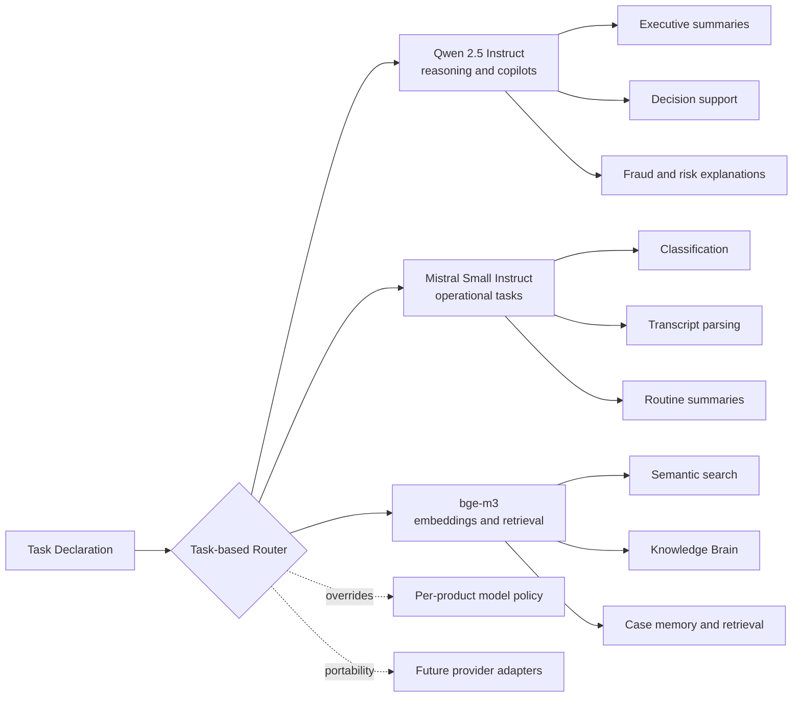

# AI and Model Routing Architecture

## Purpose

Document the open-source-first model routing design across reasoning, operational, and embedding workloads.

## Intended Audience

AI architects, platform leaders, and technically curious executives.

## Why It Matters

This diagram shows cost control, portability, and task-based model discipline without tying the suite to one provider.

## Mermaid Diagram

## Interpretation Notes

- Routing is based on workload type, not hard-coded provider coupling.
- Qwen handles higher-value reasoning, Mistral handles cheaper operational work, and bge-m3 supports retrieval.
- The diagram is strong evidence of practical AI platform judgment.

@BryteSikaStrategyAI
