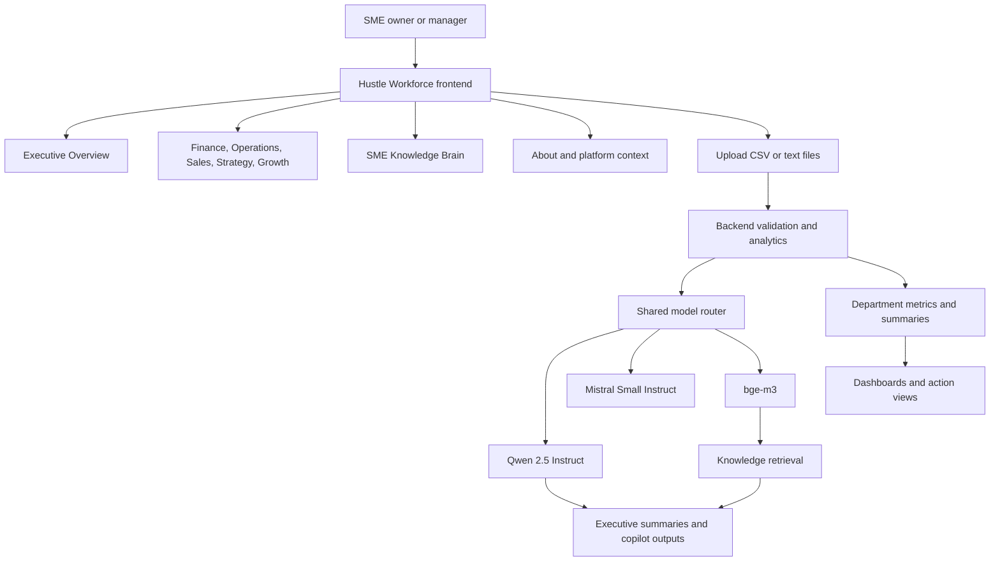

# Hustle Workforce Architecture

## Purpose

Show the flagship product architecture across uploads, departmental analytics, Knowledge Brain retrieval, and executive outputs.

## Intended Audience

CTO interviewers, platform reviewers, and executive product stakeholders.

## Why It Matters

Hustle Workforce represents the portfolio's broadest operating-system style product and is the clearest flagship architecture story.

## Mermaid Diagram

## Interpretation Notes

- Workforce combines departmental analysis with retrieval and executive support.
- It is best framed as a flagship SME decision-support environment.
- The diagram is useful when asked how one product can span multiple business functions without losing architectural coherence.

@BryteSikaStrategyAI
