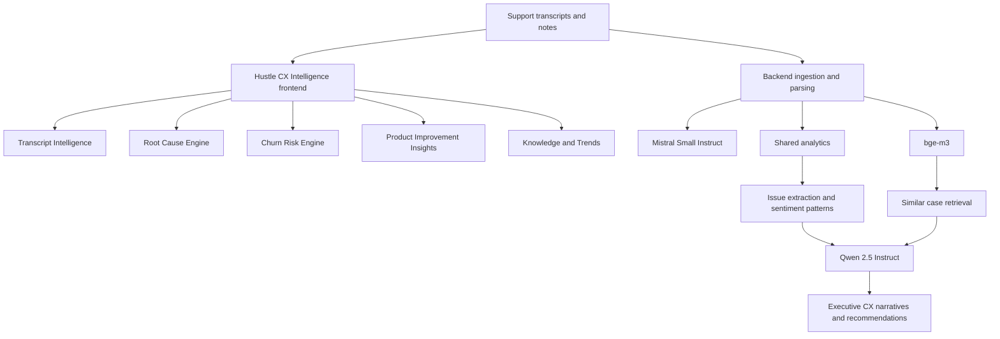

# Hustle CX Intelligence Architecture

## Purpose

Show how transcript inputs become classification, root-cause analysis, churn signals, and executive CX insight.

## Intended Audience

Hiring managers, AI product leaders, and customer-operations stakeholders.

## Why It Matters

This product demonstrates how operational text flows can be transformed into leadership-grade customer insight.

## Mermaid Diagram

## Interpretation Notes

- Operational transcript handling starts with lighter models and retrieval, then escalates to reasoning for narrative insight.
- The product-level flow is easy to explain in interviews because each stage has a clear business outcome.
- This is especially useful for Director of Data or AI product conversations.

@BryteSikaStrategyAI
