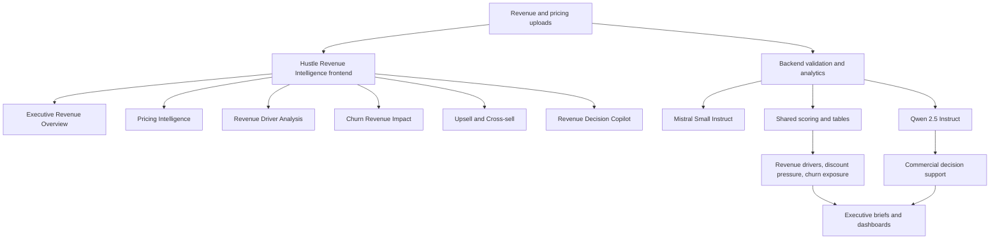

# Hustle Revenue Intelligence Architecture

## Purpose

Show how commercial data supports pricing insight, revenue-driver analysis, churn exposure, and growth decisions.

## Intended Audience

Commercial-tech interview panels, solution architects, and revenue operations leaders.

## Why It Matters

This diagram links business mechanics like pricing discipline and churn to reusable AI architecture patterns.

## Mermaid Diagram

## Interpretation Notes

- The architecture fits an executive commercial workflow rather than a generic BI dashboard pattern.
- It shows where structured analytics and reasoning outputs complement one another.
- Good for explaining commercial AI without sounding vague.

@BryteSikaStrategyAI
