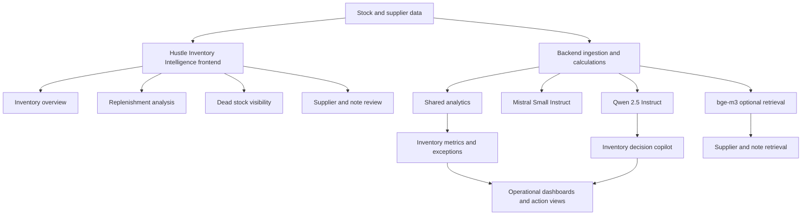

# Hustle Inventory Intelligence Architecture

## Purpose

Show how stock, supplier, and replenishment data become operational visibility and decision support.

## Intended Audience

Operations leaders, architects, and hiring managers evaluating supply-side systems thinking.

## Why It Matters

Inventory architecture demonstrates practical operational AI beyond pure text-heavy use cases.

## Mermaid Diagram

## Interpretation Notes

- Inventory Intelligence combines operational math, supplier context, and higher-value interpretation.
- The optional retrieval path shows platform extensibility without claiming more than the repo needs today.
- This is useful in operations and architecture discussions.

@BryteSikaStrategyAI
