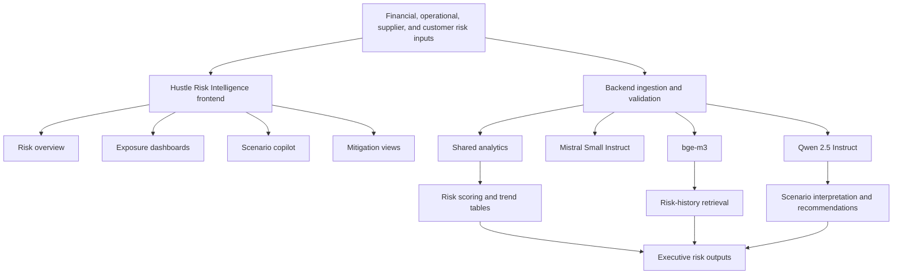

# Hustle Risk Intelligence Architecture

## Purpose

Show how risk inputs are transformed into exposure monitoring, scenario review, and leadership-ready recommendations.

## Intended Audience

Risk leaders, governance stakeholders, and enterprise architecture reviewers.

## Why It Matters

The product shows how AI can support structured business risk interpretation without collapsing into vague generic chat.

## Mermaid Diagram

## Interpretation Notes

- The architecture makes risk analysis feel like a monitored business system rather than a one-off prompt.
- Retrieval adds continuity, while reasoning supports explanation and prioritization.
- Useful for Head of Risk Technology and Director interviews.

@BryteSikaStrategyAI
