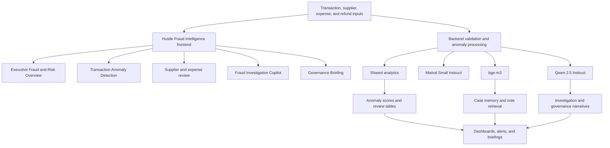

# Hustle Fraud Intelligence Architecture

## Purpose

Show how transaction, supplier, expense, and refund signals support anomaly review, investigation guidance, and governance briefings.

## Intended Audience

Fraud, audit, governance, and platform leadership audiences.

## Why It Matters

Fraud architecture is one of the clearest examples of explainable AI being applied to a high-stakes business workflow.

## Mermaid Diagram

## Interpretation Notes

- This is a strong portfolio diagram because it combines analytics, retrieval, and governance outputs in one coherent flow.
- It supports discussions about explainability, business controls, and safe AI use.
- Strong for CTO, Director, and solutions architecture positioning.

@BryteSikaStrategyAI
